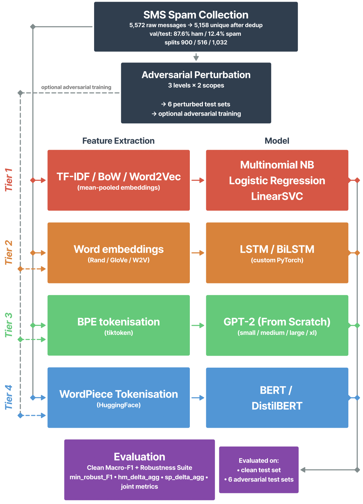

# INM434 NLP Coursework: From Bag-of-Words to Transformers

A four-tier comparison of SMS spam detection methods, built for INM434 Natural Language Processing module.

**Author:** Oleh Hastov

This repository describes the the full codebase submited to Moodle as `nlp_spam_cw_final.zip`, the data splits, the unit tests, and the instructions for evaluating the two best-trained models on the test set.

<p align="center">
  
</p>

## Contents

- [The two best-trained models](#the-two-best-trained-models)
- [Software requirements](#software-requirements)
- [Test set](#test-set)
- [Pretrained checkpoints](#pretrained-checkpoints)
- [Running Model 1: T4B_bert_lr3e-5_s789](#running-model-1-t4b_bert_lr3e-5_s789)
- [Running Model 2: T3 C04_s1011](#running-model-2-t3-c04_s1011)
- [Reproducing from scratch (optional)](#reproducing-from-scratch-optional)
- [Sanity checks](#sanity-checks)
- [Project structure](#project-structure)
- [Academic integrity](#academic-integrity)

## The two best-trained models

I picked these two by ranking every cross-seed family on the **joint_deploy** criterion. For a single seeded run that's `min(clean_test_F1, adv_mild_F1, adv_moderate_F1, adv_aggressive_F1)`; for a family the headline is the cross-seed mean of the per-seed value. It's a deployment-realistic minimum: how badly does the model do on its worst spam-side input. The ham-side is excluded on purpose because it's a diagnostic axis, not a deployment one.

Model 1 is the family with the highest joint_deploy_mean overal. Model 2 is the highest non-BERT family under the same criterion. The shipped checkpoint for each is the strongest individual seed of its family. The cross-seed family means come from the report and aggregate over all 5 seeds: those are the headline numbers in the report. The shipped seed is one member of the family, included so the marker can verify a single concrete result; running it should produce numbers in the same neighbourhood as the family mean and probably a touch higher (because it's the strongest seed).

### Model 1: T4B_bert_lr3e-5_s789

Tier 4. BERT-base-uncased, full fine-tune on the balanced training split. Best individual seed of the T4 bert lr=3e-5 family.

| Setting | Value |
| --- | --- |
| Architecture | bert-base-uncased |
| Trainable | all parameters |
| Learning rate | 3e-5 |
| Batch size | 16 |
| Max length | 128 |
| Epochs | 2 |
| Seed | 789 (shipped); family covers seeds 123, 456, 789, 1011, 1213 |

| Metric | Single seed (789, shipped) | Cross-seed mean (5 seeds, report) |
| --- | --- | --- |
| Val macro-F1 | 0.9867 | 0.9840 +/- 0.0038 |
| Test macro-F1 (clean) | 0.9818 | 0.9747 +/- 0.0069 |
| joint_deploy F1 | 0.9818 | **0.9747** |

### Model 2: T3 C04_s1011

Tier 3. GPT-2-small (124M parameters), end-to-end fine-tune with the flexible-token classification head. Best individual seed of the C04 family.

| Setting | Value |
| --- | --- |
| Architecture | gpt2 (small, 124M) |
| Trainable | all parameters |
| Token position | flexible_token |
| Context length | 120 |
| Learning rate | 5e-5 |
| Batch size | 8 |
| Dropout | 0.1 |
| Seed | 1011 (shipped); family covers seeds 123, 456, 789, 1011, 1213 |

| Metric | Single seed (1011, shipped) | Cross-seed mean (5 seeds, report) |
| --- | --- | --- |
| Val macro-F1 | 0.9865 | 0.9856 +/- 0.0019 |
| Test macro-F1 (clean) | 0.9797 | 0.9758 +/- 0.0073 |
| joint_deploy F1 | 0.9797 | **0.9672** |

> Note for the marker: the single-seed numbers in the left column are what `evaluate.py` will print when run on the shipped checkpoint. The cross-seed means in the right column are the headline numbers in the report and require running all 5 seeds of each family. The shipped seed is the strongest individual member of its family, so its single-seed numbers will be a touch above the family mean. That is by design, not a contradiction.

## Software requirements

Tested with Python 3.10 and 3.11 on macOS (MPS), and Google Colab T4 GPU. About 6 GB of free disk space if you want every checkpoint locally.

The full pinned list is in `requirements.txt`. The relevant ones for evaluation are:

- numpy >= 1.26
- pandas >= 2.2
- scikit-learn >= 1.4
- torch >= 2.2, < 3.0
- transformers >= 4.40
- tiktoken >= 0.7
- matplotlib >= 3.8
- pyarrow >= 14

Set up a virtual environment from the repo root:

```bash
python3 -m venv .venv
source .venv/bin/activate          # Windows: .venv\Scripts\activate
pip install -r requirements.txt
```

Evaluation runs in a few minutes per model on CPU. A GPU is not required for evaluation, only for re-training.

## Test set

The clean test split (1032 rows, natural ~12.4% spam) is already in this repository at `data/splits/test.csv`. The adversarial sets are in the same directory:

```
data/splits/test_adv_mild.csv
data/splits/test_adv_moderate.csv
data/splits/test_adv_aggressive.csv
data/splits/test_adv_ham_mild.csv
data/splits/test_adv_ham_moderate.csv
data/splits/test_adv_ham_aggressive.csv
```

If for any reason you want to regenerate the splits from raw UCI SMS Spam Collection (the result is byte-identical because of the fixed seed):

```bash
python -m shared.splits
python -m data.make_adversarial_test
```

## Pretrained checkpoints

Tier 1 (sklearn `.joblib` files) and Tier 2 (the LSTM `best_model.pt`) checkpoints are small and ship inside the repository:

```
tier1_classical/reports/checkpoints/
tier2_lstm/reports/best_model.pt
```

Tier 3 GPT-2 checkpoints (~500 MB each) and Tier 4 BERT/DistilBERT checkpoints (~250-500 MB each) are too big for git. The two needed for the headline models are shared as direct Drive links (anyone with the link can view):

| Model | File | Size | Drive link |
| --- | --- | --- | --- |
| Model 1 | `T4B_bert_lr3e-5_s789.pt` | ~440 MB | https://drive.google.com/file/d/1rYORvkjTHbymdja0e7aRN6wPwQZgVscg/view?usp=sharing |
| Model 2 | `C04_s1011.pt` | ~500 MB | https://drive.google.com/file/d/1tdCBOSpvPdeLretTuXxoXiCfrE_IZTn8/view?usp=sharing |

After downloading, place each file inside the repository as shown:

| File | Place at |
| --- | --- |
| `T4B_bert_lr3e-5_s789.pt` | `tier4_bert/reports/checkpoints/T4B_bert_lr3e-5_s789.pt` |
| `C04_s1011.pt` | `tier3_gpt2/reports/checkpoints/C04_s1011.pt` |

Each `.pt` is a PyTorch `state_dict`: just the trained weights. The model architecture lives in the repository code (`tier3_gpt2/gpt2_scratch/model.py` and `tier4_bert/dataset.py`), and `evaluate.py` rebuilds it before loading the weights.

## Running Model 1: T4B_bert_lr3e-5_s789

Confirm the checkpoint is in place:

```bash
ls tier4_bert/reports/checkpoints/T4B_bert_lr3e-5_s789.pt
```

Run the Tier 4 evaluation script pointing at this checkpoint:

```bash
python -m tier4_bert.scripts.evaluate \
    --checkpoint tier4_bert/reports/checkpoints/T4B_bert_lr3e-5_s789.pt
```

What the script does:

- Reloads BERT-base and loads the trained weights.
- Tokenises `data/splits/test.csv` with the bert-base-uncased tokenizer.
- Predicts on the clean test set, writes predictions and metrics.
- Also evaluates on all 6 adversarial test sets if they're present.
- Prints a summary table to stdout.
- Writes `tier4_bert/reports/metrics.json` (the headline metrics blok) and `tier4_bert/reports/errors_for_review.csv` (top FPs and FNs by model confidence, used in the cross-tier error analysis).

Expected runtime: 1-3 minutes on CPU, under 30 seconds on GPU.

## Running Model 2: T3 C04_s1011

Confirm the checkpoint is in place:

```bash
ls tier3_gpt2/reports/checkpoints/C04_s1011.pt
```

Run the Tier 3 evaluation script pointing at this checkpoint:

```bash
python -m tier3_gpt2.scripts.evaluate \
    --checkpoint tier3_gpt2/reports/checkpoints/C04_s1011.pt \
    --no-hf-init
```

The `--no-hf-init` flag skips the fresh GPT-2 download from Hugging Face, since the checkpoint already contains the fully-trained weights (saves about 500 MB of bandwidth).

What the script does:

- Rebuilds GPT-2-small with the flexible_token classification head.
- Loads the trained weights from the checkpoint.
- Tokenises `data/splits/test.csv` with the GPT-2 BPE tokenizer.
- Predicts on the clean test set and the 6 adversarial test sets.
- Prints a summary and writes `tier3_gpt2/reports/metrics.json` plus confusion-matrix PNGs to `tier3_gpt2/reports/figures/`.

Expected runtime: 2-4 minutes on CPU, around 1 minute on GPU.

## Reproducing from scratch (optional)

If for any reason the checkpoints can't be downloaded, both models can be retrained from scratch. This takes longer, but the training scripts are deterministic given the seed so the retrained checkpoints reproduce the headline numbers above to within rounding.

Tier 4 BERT-base (Model 1):

```bash
python -m tier4_bert.scripts.train --cells T4B_bert_lr3e-5_s789
```

Expected runtime: 60-120 seconds on a Colab T4 GPU.

Tier 3 GPT-2 small with the C04 config (Model 2):

```bash
python -m tier3_gpt2.scripts.train --cells C04_s1011
```

Expected runtime: 8-12 minutes on a Colab T4 GPU.

## Sanity checks

If you want to confirm the project is healthy before running either model, the unit test suite runs without a GPU:

```bash
pytest tests/ -q
pytest tier1_classical/tests/ -q
pytest tier2_lstm/tests/ -q
pytest tier3_gpt2/tests/ -q
pytest tier4_bert/tests/ -q
```

All tests should pass. If pytest reports failures it's usually a dependency version mismatch, try upgrading from `requirements.txt`.

## Project structure

```
data/                  UCI SMS Spam Collection plus the script that builds
                       train / val / test / adversarial CSVs
shared/                cross-tier infrastructure: splits, metrics, grid runner,
                       checkpointing, comparison
tier1_classical/       TF-IDF / BoW / Word2Vec with NB / LR / SVM
tier2_lstm/            LSTM and BiLSTM with random / GloVe / Word2Vec
tier3_gpt2/            GPT-2 implemented from scratch in PyTorch
                       (adapted from Raschka 2024, ch02-ch06)
tier4_bert/            fine-tuned BERT-base / DistilBERT via Hugging Face
tests/                 unit tests for the shared/ infrastructure
colab/                 Colab notebooks used for grid training
```

Each tier has the same internal layout: `config_grid.py` listing the cells in the grid, a `scripts/` folder with `train.py` and `evaluate.py`, and a `reports/` folder with predictions, metadata, history, and checkpoints.

## Academic integrity

Every file in `tier3_gpt2/gpt2_scratch/` that contains code adapted from Sebastian Raschka, *Build a Large Language Model (From Scratch)*, Manning, 2024, carries a header coment naming source chapter and the adaptation mode (REWRITE for small verifiable layers, ADAPT for the math-critical reshape lines). Everything else is original work.

Pretreined weights for Tier 3 (GPT-2 from OpenAI via Hugging Face) and Tier 4 (BERT-base-uncased and DistilBERT-base-uncased via Hugging Face) are downloaded the first time they're used. Both sources are cited in the report.

## Contact

If anything in these instructions doesn't work, or if a checkpoint appears to be missing from the Drive folder, please get in touch through my City email address.
